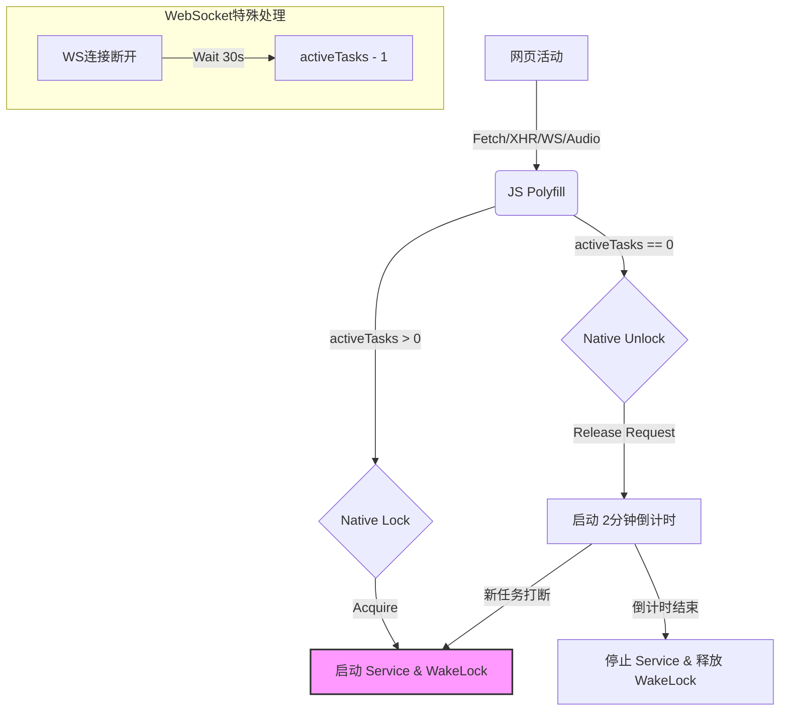

# WebView 浏览器开发文档

本文档详细说明了 WebView 浏览器项目的架构、核心功能实现细节以及主要类和方法的用途。

## 1. 项目概述

本项目是一个基于 Android WebView 的轻量级浏览器，具有以下核心特性：
*   **沉浸式体验**：支持 Edge-to-Edge 布局，可隐藏状态栏和地址栏。
*   **智能后台保活**：默认开启，通过智能监测网页活动（网络请求、音频播放）来自动管理 WakeLock，支持 AI 网页持续运行。
*   **网页通知桥接**：将网页的 HTML5 Notification 转发为 Android 系统通知。
*   **高度可配置**：支持自定义 User Agent、JavaScript 开关、地址栏位置等。
*   **书签管理**：支持添加和管理网页书签。
*   **原生拍照**：集成 CameraX 实现应用内拍照上传。

## 2. 核心类说明

### 2.1 MainActivity.kt

应用的主入口，负责 UI 逻辑、WebView 管理和设置应用。

#### 核心方法

*   **`onCreate(savedInstanceState: Bundle?)`**
    *   **作用**：Activity 初始化入口。
    *   **逻辑**：
        *   初始化 ViewBinding。
        *   注册 `SharedPreferences` 监听器。
        *   **Edge-to-Edge 适配**：全局设置 `LAYOUT_IN_DISPLAY_CUTOUT_MODE_SHORT_EDGES` 以适配挖孔屏。
        *   **窗口适配监听器 (`OnApplyWindowInsetsListener`)**：这是解决 UI 遮挡问题的核心。它监听系统窗口 Insets（状态栏、键盘等），并根据当前设置（是否隐藏状态栏/地址栏）动态计算并应用 Padding。
            *   处理底部键盘遮挡：始终为根布局应用底部 Padding。
            *   处理顶部布局：手动计算 ActionBar 高度，根据状态栏可见性动态调整 WebView 的顶部 Padding，确保内容不被遮挡且无多余白边。

*   **`setupWebView()`**
    *   **作用**：初始化 WebView 及其配置。
    *   **逻辑**：
        *   启用 JavaScript、DOM Storage。
        *   设置 `mediaPlaybackRequiresUserGesture = false` 允许后台自动播放音频。
        *   **注入 JS 接口**：`addJavascriptInterface(WebAppInterface(...), "Android")`。
        *   设置 `WebViewClient` 和 `WebChromeClient`。
        *   **文件选择处理**：重写 `onShowFileChooser`，根据 `isCaptureEnabled` 智能判断是启动相机还是文件选择器。

*   **`setupDraggableFab()`**
    *   **作用**：初始化可拖动的悬浮按钮。
    *   **逻辑**：
        *   使用 `setOnTouchListener` 监听触摸事件。
        *   处理拖动位移。
        *   区分点击和拖动操作。
        *   实现松手后的自动边缘吸附动画。

*   **`injectNotificationPolyfill(view: WebView?)`**
    *   **作用**：在网页加载开始和结束时注入 JavaScript 代码。
    *   **逻辑**：重写网页的 `window.Notification` 对象，将其请求转发给 Android 原生接口 `Android.showNotification`，从而实现网页通知在系统状态栏显示。

*   **`applySettings()`**
    *   **作用**：读取用户偏好设置并应用到当前环境。
    *   **逻辑**：根据 `SharedPreferences` 的值，调用 `applyUserAgent`、`hideAddressBar` 等具体方法。注：保活功能已改为自动管理，不再在此处调用。

*   **`enableKeepAlive()` / `disableKeepAlive()`**
    *   **作用**：开启或关闭后台保活模式（内部调用，不再由用户直接控制）。
    *   **逻辑**：
        *   启动/停止 `KeepAliveService` 前台服务。
        *   请求 `ACTION_REQUEST_IGNORE_BATTERY_OPTIMIZATIONS` 权限。
        *   **智能管理**：由 `injectKeepAlivePolyfill` 注入的 JS 代码触发。

*   **`injectKeepAlivePolyfill(view: WebView?)`**
    *   **作用**：注入 JavaScript 代码以监听网页活动。
    *   **逻辑**：
        *   Hook `fetch`, `XMLHttpRequest`, `WebSocket`, `Audio` 等 API。
        *   维护 `activeTasks` 计数器。
        *   当计数器从 0 变 1 时调用 `Android.acquireWakeLock()`。
        *   当计数器从 1 变 0 时调用 `Android.releaseWakeLock()`。

*   **`hideStatusBar()` / `showStatusBar()`**
    *   **作用**：控制系统状态栏的显示与隐藏。
    *   **逻辑**：
        *   使用 `WindowInsetsController` 隐藏/显示状态栏。
        *   设置状态栏颜色（隐藏时透明，显示时跟随主题）。
        *   调用 `ViewCompat.requestApplyInsets` 触发布局更新。

*   **`hideAddressBar()` / `showAddressBar()`**
    *   **作用**：控制顶部地址栏的显示与隐藏。
    *   **逻辑**：
        *   切换 `AppBarLayout` 的可见性 (`GONE` / `VISIBLE`)。
        *   调用 `ViewCompat.requestApplyInsets` 强制触发根布局的 Insets 监听器，以便重新计算 WebView 的位置。

#### 内部类

*   **`inner class WebAppInterface`**
    *   **作用**：供 JavaScript 调用的原生接口。
    *   **方法**：
        *   `showNotification(title, body)`: 发送系统通知。
        *   `acquireWakeLock()`: 请求获取 WakeLock（有活跃任务）。
        *   `releaseWakeLock()`: 请求释放 WakeLock（无活跃任务，延迟释放）。

### 2.2 KeepAliveService.kt

用于维持应用在后台运行的前台服务。

#### 核心方法

*   **`onStartCommand(...)`**
    *   **作用**：服务启动入口。
    *   **逻辑**：
        *   创建并显示一个持续的 Notification（"正在后台运行..."），将服务提升为前台服务 (`startForeground`)。
        *   适配 Android 14，指定 `FOREGROUND_SERVICE_TYPE_DATA_SYNC` 类型。
        *   调用 `acquireWakeLock()`。

*   **`acquireWakeLock()`**
    *   **作用**：申请电源锁 (WakeLock)。
    *   **逻辑**：获取 `PARTIAL_WAKE_LOCK`。与 v1.2 不同，v1.3 移除了自动超时限制，锁的生命周期完全由 `MainActivity` 的智能逻辑控制。

### 2.3 SettingsActivity.kt

基于 `PreferenceFragmentCompat` 的设置页面，负责加载 `xml/preferences.xml` 并处理用户交互。

### 2.4 BookmarkManager.kt

负责书签数据的持久化存储和管理。

*   **功能**：
    *   使用 `SharedPreferences` 存储书签列表（JSON 格式）。
    *   提供 `addBookmark`、`getBookmarks`、`removeBookmark` 等方法。
    *   自动按时间戳排序。

### 2.5 CameraActivity.kt

基于 CameraX 实现的自定义相机界面。

*   **功能**：
    *   集成 CameraX 预览 (`Preview`) 和拍照 (`ImageCapture`) 用例。
    *   提供简单的拍照 UI（快门按钮）。
    *   拍照后将图片保存到应用缓存目录，并通过 `setResult` 返回 URI。

## 3. 关键技术实现细节

### 3.1 解决键盘遮挡与全屏白条问题

为了同时解决"键盘遮挡输入框"和"隐藏地址栏后顶部留白"的问题，本项目放弃了传统的 `fitsSystemWindows="true"` 和 `CoordinatorLayout` 的自动行为，转为**完全手动控制 Insets**。

1.  **全局 Edge-to-Edge**：在 `onCreate` 中设置 `setDecorFitsSystemWindows(false)`，让内容延伸到屏幕边缘。
2.  **手动 Padding 计算** (`OnApplyWindowInsetsListener`)：
    *   **底部**：直接将 `ime` (输入法) 和 `systemBars` (导航栏) 的高度应用为 Root View 的底部 Padding。这样键盘弹出时，整个布局会被顶起。
    *   **顶部**：
        *   若 **地址栏显示**：计算 `ActionBar` 高度 + `StatusBar` 高度，设为 WebView 的 `paddingTop`。
        *   若 **地址栏隐藏**：强制 WebView 的 `paddingTop` 为 0。这使得 WebView 内容能直接延伸到状态栏区域（沉浸式），消除了白条。

### 3.2 网页通知实现原理

Android WebView 默认不支持 HTML5 Notification API。本项目通过以下步骤实现：
1.  **Native 端**：定义 `WebAppInterface`，提供 `showNotification` 方法发送系统通知。
2.  **JS 注入**：在 `onPageStarted` 中注入 JS 代码，劫持 `window.Notification` 构造函数。
3.  **桥接**：当网页调用 `new Notification()` 时，实际上执行的是 Native 的 `showNotification`，从而在手机状态栏显示通知。

## 4. 权限说明

*   `FOREGROUND_SERVICE` / `FOREGROUND_SERVICE_DATA_SYNC`: 用于后台保活服务。
*   `POST_NOTIFICATIONS`: 用于发送状态栏通知（Android 13+）。
*   `REQUEST_IGNORE_BATTERY_OPTIMIZATIONS`: 用于申请白名单，防止电池优化杀后台。
*   `WAKE_LOCK`: 用于保持 CPU 唤醒。
*   `INTERNET`: 网络访问。
*   `CAMERA`: 用于网页内拍照上传。

## 5. 新增功能实现细节 (v1.1)

### 5.1 书签功能

*   **入口**：地址栏右侧的书签按钮。
*   **交互**：
    *   点击按钮弹出悬浮列表 (`PopupWindow`)。
    *   列表位置根据地址栏位置（顶部/底部）自动调整，避免遮挡。
    *   支持添加当前网页为书签，自动预填充标题和 URL。
    *   数据存储在本地 `SharedPreferences` 中。

### 5.2 可拖动悬浮按钮 (FAB)

为了解决悬浮按钮遮挡网页内容的问题，实现了可拖动逻辑：
*   **实现**：在 `MainActivity` 中使用 `setOnTouchListener` 替代 `setOnClickListener`。
*   **逻辑**：
    *   监听 `ACTION_MOVE` 更新按钮位置，实现全屏拖动。
    *   监听 `ACTION_UP` 判断是点击还是拖动（基于位移和时间阈值）。
    *   实现**自动吸附**：松手后按钮自动动画吸附到屏幕左侧或右侧边缘，保持界面整洁。

### 5.3 文件上传与相机集成

解决了 WebView 中 `<input type="file">` 无法使用的问题，并优化了拍照体验。

1.  **智能分发 (`onShowFileChooser`)**：
    *   重写 `WebChromeClient.onShowFileChooser`。
    *   检查 `fileChooserParams.isCaptureEnabled`。
    *   **直接拍照**：如果网页请求捕获（如点击相机图标），直接启动 `CameraActivity`。
    *   **文件选择**：如果网页请求文件（如点击附件图标），直接启动系统文件选择器。
2.  **CameraX 集成**：
    *   使用 Jetpack CameraX 库替代系统相机应用，提供更统一的拍照体验。
    *   自定义 `CameraActivity`，包含预览和拍照功能。

## 6. 新增功能实现细节 (v1.2)

### 6.1 地址栏优化与悬浮按钮增强

*   **收起地址栏**：在地址栏右侧新增了收起按钮 (`ic_expand_less`)，点击即可隐藏地址栏并显示悬浮按钮 (FAB)。
*   **FAB 自动半隐藏**：
    *   为了减少对网页内容的遮挡，FAB 在闲置 3 秒后会自动移动到屏幕边缘，只露出 30% 的宽度并降低透明度。
    *   **实现**：使用 `Handler` 和 `Runnable` 进行倒计时，配合 `ViewPropertyAnimator` 实现平滑的位移和透明度动画。触摸 FAB 会立即重置状态。
*   **FAB 位置记忆**：
    *   FAB 的位置现在会持久化保存到 `SharedPreferences` (`fab_x`, `fab_y`)。
    *   无论应用重启还是切换地址栏显示状态，FAB 都会停留在用户上次拖动到的位置。

### 6.2 智能返回与防误触机制

*   **智能返回 (`OnBackPressedCallback`)**：
    *   重构了返回逻辑，使用 `OnBackPressedDispatcher` 替代过时的 `onBackPressed`。
    *   **逻辑**：优先检查 `webView.canGoBack()`。如果可以后退，则执行网页后退；否则才执行系统默认的返回操作（退出应用）。
*   **防误触域名管理**：
    *   **配置页面**：新增 `BlockedDomainsActivity`，提供可视化的域名管理界面（类似书签管理）。
    *   **逻辑**：
        *   当用户处于防误触列表中的域名时，按下返回键会被拦截。
        *   系统会显示 Toast 提示"再按 X 次返回"。
        *   用户必须在 2 秒内连续按 3 次返回键，才能执行后退或退出操作。
        *   **优先级**：防误触检查优先于网页后退检查。即使是"恢复上次浏览"打开的页面（无法后退），在防误触域名下退出应用也需要三连击。
    *   **域名匹配**：支持自动提取用户输入 URL 的域名部分，匹配时忽略大小写。

### 6.3 恢复上次浏览页面

*   **实现**：
    *   **保存**：在 `WebViewClient.onPageFinished` 中，将当前 URL 保存到 `SharedPreferences` (`last_url`)。
    *   **恢复**：在 `MainActivity.loadHomePage` 中，检查 `restore_last_page` 设置。如果开启且存在保存的 URL，则加载该 URL；否则加载默认主页。

## 7. 新增功能实现细节 (v1.3)

### 7.1 智能后台保活 (Smart Keep Alive)

为了解决"手动开关保活不便"和"无法精确判断 AI 生成状态"的问题，v1.3 引入了智能保活机制。

*   **设计理念**：默认开启，无感介入。只有在网页真正"忙碌"时才持有 WakeLock，闲置时自动释放以节省电量。
*   **实现原理**：
    1.  **JS 探针 (`injectKeepAlivePolyfill`)**：
        *   **Fetch / XHR**：拦截请求开始和结束，计数器加减。
        *   **WebSocket**：拦截连接建立和断开。**特殊处理**：断开连接后会延迟 30 秒才减少计数器，以覆盖断线重连的时间窗口，防止意外释放锁。
        *   **Audio/Video**：监听 `play`, `pause`, `ended` 事件，计数器加减。
    2.  **Native 联动 (`WebAppInterface`)**：
        *   **上锁 (`acquireWakeLock`)**：当 JS 端检测到活跃任务数 > 0 时调用。Native 端立即启动前台服务并持有 WakeLock。
        *   **解锁 (`releaseWakeLock`)**：当 JS 端检测到活跃任务数归 0 时调用。
    3.  **防抖动机制 (Grace Period)**：
        *   为了防止网络请求间隙或短暂停顿导致服务频繁重启，`releaseWakeLock` 不会立即释放锁。
        *   **2 分钟倒计时**：Native 端收到解锁请求后，启动一个 2 分钟的定时器。只有在 2 分钟内没有新的上锁请求，才会真正停止服务和释放 WakeLock。

### 7.2 流程图



## 8. 新增功能实现细节 (v1.4)

### 8.1 多标签页状态持久化

为了实现"应用关闭后下次启动还能访问这些页面"的需求，v1.4 引入了多标签页状态持久化机制。

*   **功能描述**：
    *   当用户添加、关闭、切换标签页，或者网页加载完成、标题更新时，应用会自动保存当前所有标签页的状态。
    *   应用重启时，会自动恢复之前打开的所有标签页（URL 和 Title），并切换到上次选中的标签页。
    *   **注意**：仅恢复 URL 和 Title，不恢复网页内部的滚动位置、表单输入等临时状态。

*   **实现原理**：
    *   **数据存储**：使用 `SharedPreferences` 存储一个 JSON 数组 (`tabs_list`)，其中包含每个标签页的 ID、URL 和 Title。同时存储当前选中标签页的 ID (`current_tab_id`)。
    *   **保存时机 (`TabManager.saveTabs`)**：
        *   `TabManager`: `addTab`, `closeTab`, `switchToTab`。
        *   `MainActivity`: `onPageFinished` (页面加载完成), `onReceivedTitle` (标题更新)。
    *   **恢复时机 (`TabManager.restoreTabs`)**：
        *   `MainActivity.onCreate`: 在初始化标签页之前尝试恢复。如果恢复成功，则跳过创建默认新标签页的步骤。

### 8.2 接口与字段详解

#### 8.2.1 TabManager.kt

负责管理所有标签页的生命周期、状态保存与恢复。

*   **`saveTabs(context: Context)`**
    *   **作用**：将当前标签页列表持久化到本地存储。
    *   **参数**：`context` - 用于获取 `SharedPreferences`。
    *   **存储格式**：
        *   `tabs_list`: JSON 数组字符串，包含每个标签页的 `id`, `url`, `title`。
        *   `current_tab_id`: 当前选中标签页的 ID。

*   **`restoreTabs(context: Context, webViewFactory: (Context) -> WebView): Boolean`**
    *   **作用**：从本地存储恢复标签页列表。
    *   **参数**：
        *   `context`: 上下文。
        *   `webViewFactory`: 一个高阶函数，用于创建新的 `WebView` 实例（因为 `WebView` 创建需要 `Context` 且需要配置）。
    *   **返回值**：`true` 表示恢复成功（至少恢复了一个标签页），`false` 表示无数据或恢复失败。

#### 8.2.2 Tab.kt

标签页的数据模型。

*   **字段说明**：
    *   `id: String`: 唯一标识符 (UUID)。
    *   `webView: WebView`: 持有的 WebView 实例。
    *   `title: String`: 网页标题。
    *   `url: String`: 当前 URL。
    *   `favicon: Bitmap?`: 网页图标。
    *   `lastActiveTime: Long`: 最后一次活跃时间戳，用于判断是否需要休眠。
    *   `isBackgroundPaused: Boolean`: 标记该标签页是否已被后台策略暂停（调用了 `onPause`）。
    *   `isKeepAliveActive: Boolean` (v1.4新增): 标记该标签页是否正在执行保活任务（如播放音频、WebSocket 连接等）。
        *   **作用**：当此字段为 `true` 时，即使 `lastActiveTime` 超时，`TabManager` 也不会强制休眠该标签页，防止音频中断或连接断开。

#### 8.2.3 MainActivity.kt (WebAppInterface)

*   **`acquireWakeLock()`**
    *   **更新**：除了申请系统 WakeLock 外，现在还会将对应 `Tab` 的 `isKeepAliveActive` 设置为 `true`。
*   **`releaseWakeLock()`**
    *   **更新**：释放系统 WakeLock 时，将对应 `Tab` 的 `isKeepAliveActive` 设置为 `false`。

### 8.3 熄屏超时释放锁与日志功能

为了进一步优化电量消耗并提供调试手段，v1.4 引入了熄屏超时释放锁和唤醒锁日志功能。

*   **熄屏超时释放锁**：
    *   **功能**：当屏幕熄灭后，如果应用在后台持有唤醒锁（例如正在播放音频），系统会启动一个倒计时（默认 30 分钟）。如果倒计时结束屏幕仍未点亮，应用将强制释放所有唤醒锁并停止后台服务。
    *   **配置**：用户可以在设置中自定义等待时间（5分钟、15分钟、30分钟、1小时、从不）。选择"从不"将禁用此功能。
    *   **实现**：通过 `BroadcastReceiver` 监听 `ACTION_SCREEN_OFF` 和 `ACTION_SCREEN_ON`，配合 `Handler` 实现延时任务。

*   **唤醒锁日志**：
    *   **功能**：记录唤醒锁的获取和释放操作，以及强制释放锁的事件。
    *   **配置**：用户可以在设置中开启"启用唤醒锁日志"。
    *   **查看**：在设置中点击"查看日志"即可查看最近的日志记录。支持一键清空日志。
    *   **限制**：日志文件大小限制为 2MB，超过限制会自动清理旧日志。

## 9. 新增功能实现细节 (v1.5)

### 9.1 页面级休眠（TabManager）

*   **30 秒无活动自动休眠**：后台标签页（非当前显示页）在 30 秒内无活跃任务时调用 `webView.onPause()`，暂停 JS 执行与渲染以节能。
*   **活跃任务豁免**：`isKeepAliveActive == true` 时视为活跃，不进入后台休眠，并持续刷新 `lastActiveTime`。

### 9.2 应用后台强制休眠

*   **触发条件**：应用进入后台且 5 分钟内无活跃任务（WakeLock 持有者为空）。
*   **动作**：强制清空所有 WakeLock 持有者、停止 `KeepAliveService`，标记应用休眠；休眠中 JS 的 `acquireWakeLock` 请求被拒绝。
*   **唤醒方式**：用户回到前台自动退出休眠，恢复锁申请。

### 9.3 熄屏强制休眠

*   **触发条件**：屏幕持续熄灭超过设置的时间（默认 30 分钟，可选 5/15/30/60 分钟或关闭），无论是否有活跃任务。
*   **动作**：同后台强制休眠，释放全部锁并停止后台服务；熄屏休眠中 JS 不可申请新锁。
*   **唤醒方式**：点亮屏幕后退出熄屏休眠，恢复锁申请。

### 9.4 续期与日志优化

*   **续期机制**：后台/熄屏倒计时期间出现新活跃任务会重置计时（续命），避免误休眠。
*   **日志简化**：仅记录关键状态（进入休眠、唤醒、任务续期、强制释放锁），不再记录每次 JS 锁申请/释放，防止日志刷屏。

## 10. 状态栏行为变更 (v1.6)

### 10.1 状态栏隐藏开关移除

为了提供更沉浸的浏览体验，v1.6 移除了设置中的状态栏隐藏开关。

*   **变更内容**：
    *   从 `app/src/main/res/xml/preferences.xml` 中完全删除 `SwitchPreferenceCompat` 条目 (`android:key="hide_status_bar"`)。
    *   从 `app/src/main/res/values/strings.xml` 中删除 `pref_hide_status_bar` 和 `pref_hide_status_bar_summary` 字符串资源。
    *   用户无法再通过设置界面手动控制状态栏的显示与隐藏。

### 10.2 默认始终隐藏状态栏

状态栏现在默认且始终处于隐藏状态。

*   **实现原理**：
    *   在 `MainActivity.applySettings()` 中，移除了对 `hide_status_bar` 设置的依赖，直接调用 `hideStatusBar()`。
    *   应用启动时（`onCreate`）也会立即隐藏状态栏。
    *   `MainActivity.onSharedPreferenceChanged()` 中移除了对 `"hide_status_bar"` 的响应逻辑。

*   **代码变更**：
    ```kotlin
    // 原代码 (v1.5):
    if (prefs.getBoolean("hide_status_bar", false)) {
        hideStatusBar()
    } else {
        showStatusBar()
    }
    
    // 新代码 (v1.6):
    hideStatusBar() // 始终隐藏
    ```

### 10.3 下拉状态栏自动隐藏

为了保持沉浸式体验的一致性，即使手动下拉状态栏，系统也会在短暂显示后自动隐藏。

*   **功能描述**：
    *   用户通过手势下拉显示状态栏后，系统会延迟 3 秒，然后自动将其隐藏。
    *   无需任何用户操作，状态栏会在显示 3 秒后消失。
    *   在此期间，用户仍可正常查看状态栏信息（时间、电量、通知等）。

*   **实现原理**：
    *   在 `MainActivity` 的 `OnApplyWindowInsetsListener` 监听器中检测状态栏是否显示。
    *   当 `insets.top > 0`（表示状态栏可见）时，启动一个延迟 3000 毫秒的 `Handler` 任务，调用 `hideStatusBar()`。
    *   使用 `fabHandler.postDelayed` 实现延迟隐藏，避免频繁调用。

*   **代码位置** (`app/src/main/java/com/webview/browser/MainActivity.kt`)：
    ```kotlin
    // 在 OnApplyWindowInsetsListener 中
    if (insets.top > 0) { // 状态栏可见
        fabHandler.postDelayed({
            hideStatusBar()
        }, 3000) // 3 秒后自动隐藏
    }
    ```

### 10.4 布局适配优化

状态栏始终隐藏后，顶部布局计算也相应简化。

*   **变更内容**：
    *   在 `OnApplyWindowInsetsListener` 中，顶部 padding 固定为 0，不再根据状态栏可见性动态调整。
    *   移除了过时的 `setOnSystemUiVisibilityChangeListener` 和 `SYSTEM_UI_FLAG_FULLSCREEN` 的使用，改用 `WindowInsets` 检测状态栏显示。

*   **影响**：
    *   WebView 内容始终延伸到状态栏区域，实现真正的全屏沉浸体验。
    *   消除了状态栏隐藏/显示切换时可能出现的布局跳动。

### 10.5 设置界面清理

`SettingsActivity.kt` 仅加载 `preferences.xml`，无需特殊修改，因为状态栏开关项已从 XML 中移除，界面会自动更新。

## 11. 下一步计划

*   **键盘自动隐藏**：考虑在 WebView 失去焦点时自动隐藏软键盘。
*   **状态栏沉浸式通知**：探索将系统通知集成到应用内，避免状态栏临时显示。
*   **多窗口模式适配**：优化在分屏模式下状态栏的显示行为。

---
*文档版本：v1.6 | 更新日期：2025年12月25日*
